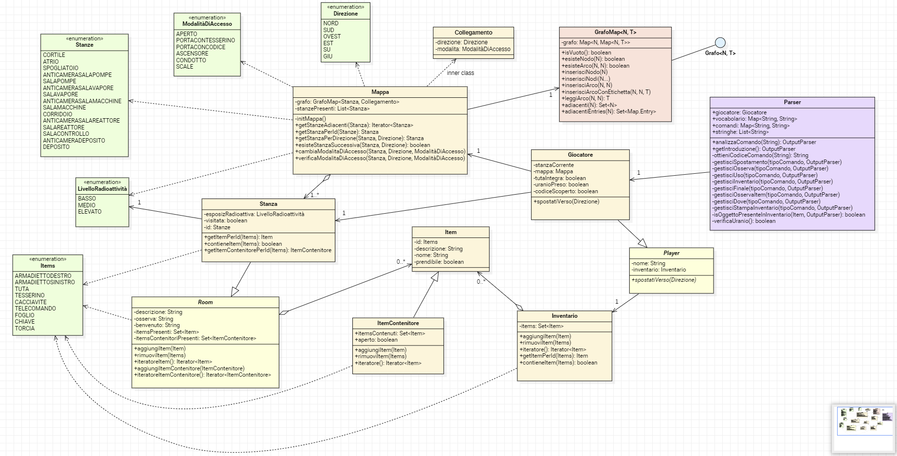
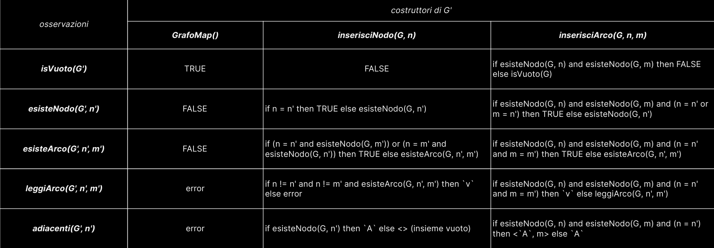

# "Atomic Quest" - Un'avventura testuale

# DOCUMENTAZIONE ATOMIC QUEST

## Team: Stea Giovanni, Scazzari Lorenzo, Ventrella Giuseppe

Abbiamo realizzato un'avventura testuale, scritta in linguaggio Java, con titolo **Atomic Quest**.

## 1. Introduzione al gioco

### 1.1 Trama del gioco

Il gioco è ambientato nel 2087, dopo tre decenni dal termine del terzo conflitto mondiale, il quale ha visto esaurirsi quasi tutte le riserve di uranio-238 (combustibile utilizzato per produrre il materiale fissile in grado di far funzionare un ordigno atomico). La fine del conflitto ha stravolto la situazione geopolitica del globo, lasciandolo in mano alle due superpotenze vincitrici della guerra nucleare: Panamerica e Nova Asia. Il protagonista dell'avventura è l'agente segreto panamericano Jack Shepard, recentemente venuto a conoscenza della presenza di uranio nel deposito di una centrale nucleare abbandonata. E' qui che si svolge il gioco: dovrai recuperare l'uranio all'interno della centrale prima che i nemici ne vengano a conoscenza, di modo che la tua nazione potrà avere finalmente l'opportunità di porre fine alla minaccia nemica e imporre la pace sul mondo.

### 1.2 Come giocare

Il gioco da noi realizzato è un'avventura testuale. Potrai visualizzare delle descrizioni sull'interfaccia di gioco e, tramite la stessa, può interagire scrivendo comandi testuali. Il giocatore potrà muoversi verso nord, sud,est, ovest, in alto o in basso. 

Durante il gioco potrai interagire con alcuni bottoni per poter mettere il gioco in pausa (ed eventualmente salvare), visualizzare le immagini degli oggetti presenti nell'inventario nonchè visualizzare una guida su come giocare.

Visualizzerai sullo schermo anche la radioattività della stanza e lo stato della tuta di Jack Shepard.

Alcune stanze di gioco non sono accessibili se non si dispone di determinati oggetti come un tesserino o un telecomando. Altre stanze invece non sono accessibili poichè radioattive, a meno che non si disponga della tuta adatta.

Durante il gioco potrai raccogliere oggetti ed saranno visualizzabili nel tuo inventario. Questi sono utili per poter procedere durante il gioco. Li si potrà raccogliere mediante comandi come *prendi* o *raccogli*, seguiti dal nome dell'oggetto.

La prima volta che entri in una stanza verrà visualizzata una descrizione della stessa. Mediante il comando *osserva* potrai visualizzare una breve descrizione della stanza in cui ti trovi: potrà esserti utile per capire dove andare e quali oggetti sono in essa presenti. Col comando *dove* visualizzerai semplicemente il nome della stanza in cui ti trovi.

Col comando *inventario* visualizzerai gli oggetti presenti nel tuo inventario. Ti verranno mostrate le immagini degli oggetti premendo l'apposito bottone. 

Maggiori dettagli su come giocare sono presenti durante il gioco: essi saranno visualizzati premendo l'apposito bottone *Guida*.

### 1.3 Soluzione del gioco

Di seguito elenchiamo la sequenza di comandi che ti permetteranno di concludere il gioco con successo.

1. La prima stanza in cui ti trovi è il cortile: vai a nord e ti troverai nell'atrio

2. Dall'atrio vai ad ovest: ti troverai nello spogliatoio

3. Nello spogliatoio apri l'armadietto destro: una volta aperto prendi il tesserino

4. Dallo spogliatoio vai ad est. Qui scrivi apri porta con tesserino.

5. Dall'atrio vai a nord: ti troverai nell'anticamera sala vapore

6. Dall'anticamera sala vapore vai a nord: ti troverai nella sala vapore

7. Nella sala vapore prendi il cacciavite

8. Dall sala vapore vai a sud, poi ancora a sud: ti ritroverai nell'atrio

9. Dall'atrio vai ad est: ti troverai nell'anticamera della sala pompe

10. Nell'anticamera della sala pompe apri la grata con il cacciavite

11. Dall'anticamera della sala pompe ora vai a nord: attraversando il condotto ti si romperà la tuta. Ti ritroverai nella sala pompe

12. Nella sala pompe prendi il telecomando.

13. Dalla sala pompe vai a sud, poi ad ovest, poi a nord: ti ritroverai nell'anticamera della sala vapore

14. Nell'anticamera della sala vapore apri l'ascensore con il telecomando.

15. Dall'anticamera della sala vapore vai giu: ti troverai nell'anticamera della sala macchine

16. Dall'anticamera della sala macchine vai a nord: ti troverai nella sala macchine

17. Nella sala macchine prendi il foglio e prendi la chiave.

18. Dalla sala macchine vai a sud, poi su, successivamente a sud ed infine ad est: ti ritroverai così nello spogliatoio

19. Nello spogliatoio ora puoi aprire l'armadietto sinistro che era prima chiuso: qui prendi la tuta

20. Dallo spogliatoio vai ad est, vai a nord, poi giu: ti ritroverai nell'anticamera della sala macchine

21. Dall'anticamera della sala macchine vai ad est: ti troverai nel corridoio

22. Nel corridoio apri la porta con tesserino, poi vai ad est: ti troverai nell'anticamera della sala reattore

23. Dall'anticamera della sala reattore vai ad est: ti troverai nella sala reattore

24. Nella sala reattore prendi la torcia

25. In qualsiasi stanza usa la torcia con il foglio per scoprire un codice segreto. Una volta usata la torcia col foglio verrà sbloccato l'accesso dall'anticamera del deposito  al deposito combustibile

26. Dalla sala reattore vai ad est, poi di nuovo ad est, poi ancora ad est: ti ritroverai nel corridoio

27. Dal corridoio vai a sud: ti troverai nella sala controllo

28. Dalla sala controllo vai giu: ti troverai nell'anticamera del deposito

29. Dall'anticamera del deposito vai a sud: ti troverai nel deposito combustibile

30. Nel deposito combustibile prendi l'uranio. Poi fai la tua scelta!

## 2. Struttura del software

### 2.1 Diagramma delle classi

Riportiamo il **diagramma delle classi** atto a descrivere il nostro progetto, in particolare nel diagramma sono rappresentate:

- tutte le classi *Entità*, di cui si mostrano le relazioni di associazioni diretta, dipendenza, aggregazione ed ereditarietà. Non si è reputato opportuno inserire getter e setter degli attributi;

- la *struttura dati* "GrafoMap" e la relativa implementazione dell'interfaccia generica "Grafo";

- l'associazione delle precedenti classi con la *classe Controller principale* ovvero "Parser".

Come si può notare, nella strutturazione architetturale del codice del progetto, si è quasi completamente adottato il **modello ECB** (*Entity Control Boundary*), il che ha reso il codice e il suo sviluppo meglio organizzato ed efficiente.

### 2.2 Specifica algebrica

Riportiamo ora la **specifica algebrica** della struttura dati "GrafoMap". Essa altro non è che un grafo, la cui struttura ed i suoi operatori costituiscono la base della mappa di gioco nonchè dei collegamenti tra la varie stanze (compreso il loro stato).

#### 2.2.1 Specifica sintattica

**sorts**: Grafo, Boolean, Nodo, Insieme, Valore (il tipo del peso presente su un arco del grafo)

GrafoMap() ---> Grafo

inserisciNodo(Grafo, Nodo) ---> Grafo

inserisciArco(Grafo, Nodo, Nodo) ---> Grafo

isVuoto(Grafo, Nodo) ---> Boolean

esisteNodo(Grado, Nodo) ---> Boolean

esisteArco(Grafo, Nodo, Nodo) ---> Boolean

leggiArco(Grafo, Nodo, Nodo) ---> Valore

adiacenti(Grafo, Nodo) ---> Insieme

#### 2.2.2 Specifica semantica

**declare**

G, G': Grafo

n, n', m, m' : Nodo

v : Etichetta dell'arco

A : Insieme di elementi di tipo Nodo

**Costruttori di G'**

GrafoMap()

inserisciNodo(G, n)

inserisciArco(G, n, m)

**Osservazioni**

isVuoto(G')

esisteNodo(G', n')

esisteArco(G', n', m')

leggiArco(G', n', m')

adiacenti(G', n')

Specifichiamo che i metodi "inserisciArcoConEtichetta" e "adiacentiEntries" non sono stati riportati in quanto del tutto speculari rispettivamente a "inserisciArco" e "adiacenti".

### 2.3 Scelte implementative

Elenchiamo ora gli *argomenti* utilizzati all'interno del nostro progetto e ne illustriamo l'impiego.

#### 2.3.1 File I/O

I **file** sono stati in primis il fulcro nell'*analisi sintattica e semantica del parser*. A tal proposito sono stati utilizzati i seguenti file:

- *vocabolario*, all'interno del quale sono presenti tutte le parole lecite che il giocatore può inserire nella scrittura del comando. Ad ogni parola (o per ogni gruppo di parole con lo stesso significato) viene associato un codice univoco che verrà utilizzato nella costruzione del comando lecito. Il file contiene una mappa serializzata avente come chiave la parola e come valore il codice. Tale hashmap è stata pre-serializzata attraverso uno script non inserito nel codice del progetto, in quanto non necessario al funzionamento del progetto stesso;

- *comandi*, all'interno del quale sono presenti gli effettivi comandi leciti dati dalla composizione dei codici presenti nel vocabolario. Questi comandi sono mappati ai codici delle azioni che effettivamente verrano poi eseguite nel gioco (spostarsi, prendere un oggetto). A comandi che permettono di effettuare la stessa azione è chiaramente associato lo stesso codice. All'interno della classe Parser la stringa scritta dal giocatore viene innanzitutto convertita nel corrispettivo codice utilizzando il vocabolario, e successivamente il codice ottenuto viene confrontato con i codici presenti nel file dei comandi per verificare che sia lecito. Una volta validato il comando, questo verrà discriminato in base all'azione che dovrà essere gestita (spostamento, presa oggetti, osserva,...). Anche in questo caso si è utilizzato uno script per inserire all'interno del file i comandi leciti, ma non si è ritenuto necessario inserirlo all'interno del codice del progetto;

- *stringhe*, all'interno del quale sono presenti tutte le stringhe utilizzate all'interno del gioco, come le descrizioni delle stanze, tutte le notifiche presenti, ecc.. Si è preferito utilizzare questo file per non riempire il codice di stringhe che, data la natura del gioco, sarebbero state alquanto ingombranti. Abbiamo inserito le stringhe nel file con uno script che anche in questo caso non abbiamo inserito all'interno del codice perchè ritenuto non interessante.

All'interno del progetto è stata inserita una cartella risorse contente le immagini utilizzate all'interno del gioco.

#### 2.3.2 Database

Il **database** è stato fondamentale al fine della *gestione dei salvataggi*. Abbiamo deciso di permettere all'utente di avere a disposizione un unico slot di salvataggio data la relativa breve durata del gioco. La classe adibita all'uso del database è GestioneSalvataggi, in cui sono presenti i seguenti metodi di interesse:

- *connettiAlDB*, che restituisce l'oggetto Connection, utile alla connessione al database;

- *creaTabellainDB*, che crea la tabella in cui sarà presente il salvataggio del gioco;

- *inserisciInDB*, che inserisce nella tabella l'oggetto Giocatore opportunatamente serializzato. La classe giocatore si rivela fondamentale ai fini del salvataggio in quanto contiene tutte le informazioni relative allo stato della partita, come ad esempio la stanza corrente e la mappa;

- *selezionaDaDB*, che seleziona l'unico salvataggio dal database per effettuare il caricamento della partita;

- *rimuoviDaDB*, che effettua la rimozione del salvataggio precedentemente caricato, quando il giocatore decide di salvare la partita;

- *isDBVuoto*, tale metodo controlla se il DB è vuoto nel caso l'utente voglia continuare una partita senza averne mai salvata una.

#### 2.3.3 Thread

I **thread** sono stati utili per implementare le seguenti funzionalità:

- per le *stringhe da stampare sulla JTextArea*, affinchè il testo non venga visualizzato all'istante ma venga dato un effetto visivo simile a quello della macchina da scrivere che rende più piacevole la lettura del testo. Ciò viene gestito dalla classe StampaThread. Per evitare che l'utente possa continuare a scrivere durante la stampa del testo (dal momento che le componenti Swing non sono Thread-safe), si è deciso di inibire all'utente la possibilità di scrivere sulla TextField, rendendola non editabile. Nel metodo run presente nella classe StampaThread si è inoltre impedito all'utente di continuare a scrivere una volta finito il gioco. 

- per la *chiamate REST utili alla visualizzazione del meteo*. Grazie ai thread ogni 3 minuti viene effettuata tale chiamata REST;

#### 2.3.4 REST

La classe *RESTMeteoThread* si occupa di effettuare la **chiamate REST** al server di OpenWeather per ricavare l'oggetto json. Da quest'ultimo ricaviamo l'ID che identifica la condizione meteorologica attuale della città di Bari. Tale ID è utile al fine di distinguere quale immagine dovrà essere inserita all'interno del gioco per rappresentare il meteo.

#### 2.3.5 Lambda expressions

Le **lambda expressions** sono state invece utilizzate nelle seguenti classi:

- *Parser*, nello specifico:
  
  - nel metodo *ottieniCodiceComando*, utilizziamo le lambda expressions per applicare una trasformazione ai token di un comando utilizzando una mappa di codici. Il passo principale coinvolge la definizione di una funzione lambda *codiceMapper*, che mappa ciascun token al suo corrispondente codice utilizzando la mappa di vocabolario fornita. Successivamente, questa funzione viene applicata a ciascun token del comando attraverso l'uso del metodo map() sui token del comando stesso. Questo ci consente di sostituire ogni token con il suo codice corrispondente, ottenendo così una rappresentazione del comando con i codici al posto dei token originali. Infine, i risultati di questa trasformazione vengono raccolti e concatenati in una singola stringa utilizzando il metodo collect(). In questo modo otteniamo il comando trasformato con i codici al posto dei token originali.
  
  - nell'*interfaccia funzionale "ValidatoreComando"*, nella quale è presente il metodo isValido. All'interno del metodo analizzaComando abbiamo dichiarato una variabile del tipo dell'interfaccia funzionale a cui è stata assegnata una lambda che restituisce un booleano che assume valore vero se il comando è valido.
  
  - nell'*interfaccia funzionale "RiconoscitoreComando"*, in cui è presente il metodo riconosci. All'interno della classe parser sono stati definiti degli attributi di tipo RiconoscitoreComando a cui sono stati assegnate delle lambda che controllano il codice per verificare l'azione da eseguire. 

- *RESTMeteoThread*, dove è stata definita l'interfaccia funzionale  RiconoscitoreMeteo con il metodo isMeteoCorrente. All'interno di essa sono stati definiti degli attributi RiconoscitoreMeteo a cui sono state assegnate delle lambda che controllano il codice del meteo.

- Inventario e Stanza, nel metodo *rimuoviItem*, nel quale si utilizza il metodo removeIf di List il cui predicato è una lambda expressions che controlla l'uguaglianza dell'Id passato come parametro con ciascun elemento della lista Itempresenti, al fine della rimozione.

#### 2.3.6 Swing

L'uso delle **Swing** si è rivelato fondamentale al fine della *costruzione dell'interfaccia di gioco*. Il loro utilizzo è stato significativo per la creazione delle seguenti interfacce:

- *InterfacciaAvvioGioco*, tramite la quale l'utente può iniziare una nuova partita, caricarne una precedentemente salvata, o uscire dal gioco. Nel caso in cui il giocatore prema il pulsante continua verrà richiamato il costruttore di InterfacciaGioco che si occupa della visualizzazione grafica di una partita già salvata. 

- *InterfacciaGioco*, all'interno della quale sono presenti:
  
  - una JTextArea, in cui sono visualizzate tutte le stringhe del gioco tramite anche l'utilizzo della classe StampaThread, già discussa;
  
  - una JTextField, in cui l'utente potrà impartire comandi che verranno analizzati dall'opportuno metodo di Parser;
  
  - il pulsante pausa, che setta non visibile l'interfaccia di gioco e che permette la visualizzazione dell'InterfacciaPausa;
  
  - il pulsante guida, che permette la visualizzazione di InterfacciaGuida;
  
  - il pulsante Inventario, che permette la visualizzazione di InterfacciaInventario;
  
  - la label del meteo, in cui viene visualizzata l'immagine relativa al meteo nella città di Bari in seguito alla chiamata REST;
  
  - la label del titolo del gioco;
  
  - la label della radioattività della stanza corrente del giocatore, che contiene l'immagine del livello della radioattività che cambierà in base alla stanza nella quale ci si trova;
  
  - la label del personaggio che indossa la tuta, la cui immagine cambia nel caso in cui la tuta venga danneggiata durante il gioco e quando ne viene indossata una nuova.

- *InterfacciaGuida*, che presenta un frame contenente una JTextArea in cui sono visualizzate le istruzioni che permettono al giocatore di giocare l'avventura testuale;

- *InterfacciaInventario*, che permette di visualizzare le immagini degli oggetti presenti nell'inventario del giocatore, in particolare sono presenti sei label contenti le icone di ogni oggetto. Ad ogni istanziazione dell'InterfacciaInventario viene effettuato un controllo sull'inventario corrente del giocatore.;

- *InterfacciaPausa*, in cui sono presenti tre pulsanti:
  
  - Riprendi, che permetterà di chiudere l'InterfacciaPausa e riprendere la partita risettando visibile InterfacciaGioco;
  
  - Salva, che permette di richiamare i metodi adibiti al salvataggio della partita;
  
  - Esci, che permette la chiusura del gioco.